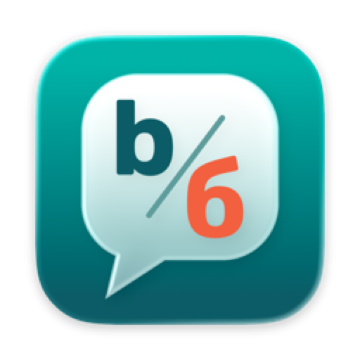

<p align="center">
  
</p>

<h1 align="center">Babbler</h1>

<p align="center">
  <strong>Typed in the wrong layout? Tap Option and it's fixed.</strong><br>
  A lightweight macOS menu bar app for switching between English and Russian keyboard layouts.
</p>

<p align="center">
  
  
  
</p>

<p align="center">
  <a href="./bin"><strong>Download</strong></a> ·
  <a href="#features">Features</a> ·
  <a href="#installation">Installation</a> ·
  <a href="#building-from-source">Build</a>
</p>

---

## How it works

Forgot to switch layouts and typed gibberish? Press the action key (**Option** by default) — Babbler deletes what you just typed, retypes it in the other layout and switches the keyboard for you.

```
Ghbdtn   →  ⌥  →  Привет
Руддщ    →  ⌥  →  Hello
```

| Action | Shortcut |
|---|---|
| Fix the last typed word | <kbd>⌥</kbd> |
| Fix the whole last line | <kbd>⇧</kbd> <kbd>⌥</kbd> |
| Fix selected text | Select, then <kbd>⌥</kbd> |

Option combos you already use (<kbd>⌥</kbd> <kbd>←</kbd>, <kbd>⌥</kbd> + click, …) keep working — Babbler only reacts to a clean tap.

## Features

- **Instant layout fix** — retypes the last word, line or selection in the other layout
- **Menu bar indicator** — shows the current input source as a flag or a contrast "EN / RU" badge
- **Per-app input sources** — automatically switch to a chosen layout when an app comes to the front
- **Clipboard history** — recently copied text, with pinned items, one click away in the menu
- **Secure input aware** — when an app enables secure input (password fields, Terminal's Secure Keyboard Entry), the icon shows a red dot and text replacement pauses; layout switching still works
- **Configurable action key** — Option, Right Option, Control or Right Control
- **Launch at login**
- **Energy efficient** — no background subprocesses; idle cost is close to zero

## Requirements

- macOS 14.4 or later
- English and Russian input sources enabled in **System Settings → Keyboard → Input Sources**
- **Accessibility** permission — needed to watch the action key and retype text

## Installation

1. Download the latest build from [`bin`](./bin) and unzip it.
2. Move **Babbler.app** to `/Applications` and launch it. The icon appears in the menu bar.
3. macOS asks for Accessibility access — click **Open System Settings** and turn on **Babbler**.
   Babbler picks the permission up automatically; no restart needed.
4. Optional: open **Settings…** from the menu bar to pick the action key, enable launch at login and set per-app input sources.

Until the permission is granted, the menu shows a reminder with a **Grant Accessibility Access…** button, and switching layouts from the menu still works.

## Building from source

Requires Xcode 26 or later (the app icon is an Icon Composer `.icon` file). No third-party dependencies.

```sh
git clone https://github.com/gevgeny/BabblerApp.git
cd BabblerApp
open Babbler.xcodeproj   # build & run the "Babbler" scheme
```

### Packaging a release

```sh
./scripts/package_app.sh
```

Builds a release archive and writes `bin/Babbler vX.Y.Z.zip`. If the full Xcode isn't your active developer directory:

```sh
DEVELOPER_DIR="/Applications/Xcode.app/Contents/Developer" ./scripts/package_app.sh
```

## Privacy

Babbler works entirely on your Mac and makes no network requests. It keeps only the last typed word or line in memory to be able to retype it and never stores keystrokes. Clipboard history lives in memory too; only items you pin are saved, in the app's local preferences. Clipboard history can be turned off in Settings.

## Troubleshooting

- **Option does nothing** — check that Babbler is enabled in **System Settings → Privacy & Security → Accessibility**. After updating the app, remove the old entry and enable it again.
- **Red dot on the icon** — either Accessibility access is missing (see the menu) or another app has turned on secure input; the menu names the app.
- **Crashes** — Babbler writes local crash logs (uncaught exceptions and fatal signals, with stack traces) to `~/Library/Application Support/Babbler/Crashes`. Please attach them to bug reports.
